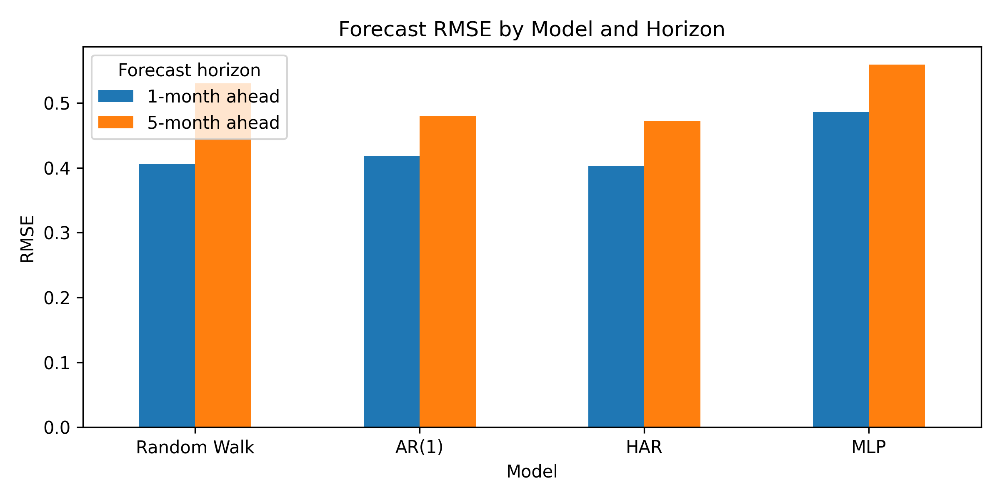
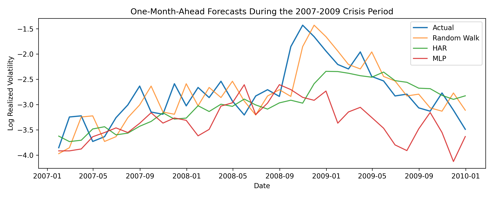

# IFTE0004 Financial Analytics and Machine Learning: RV2 Replication

Individual coursework project for **IFTE0004: Financial Analytics and Machine Learning (2025/26)**.

This repository contains a simplified Python replication of Bucci (2020), *Realized Volatility Forecasting with Neural Networks*. The analysis constructs monthly S&P 500 log realized volatility and evaluates traditional benchmarks against a feed-forward neural network.

## Scope

- Sample: S&P 500, February 1950 to December 2017
- Target: monthly log realized volatility, constructed from daily log returns
- Models: Random Walk, AR(1), HAR-style, and multilayer perceptron (MLP)
- Horizons: 1-month-ahead and 5-month-ahead forecasts
- Metrics: MSE, RMSE, MAE, QLIKE, and Diebold-Mariano comparisons against Random Walk

The implementation is intentionally narrower than Bucci (2020): it does not reproduce LSTM, NARX, macro-financial predictors, or Model Confidence Set testing. The label `HAR` in generated output figures refers to the monthly-frequency HAR-style benchmark implemented here.

## Main Finding

The HAR-style benchmark produces the lowest RMSE at both forecast horizons, while the MLP produces the highest RMSE. This differs from Bucci (2020), whose recurrent neural network results highlight LSTM and NARX, and motivates the importance of both model architecture and predictor choice.

| Horizon | Best model by RMSE | RMSE |
| --- | --- | ---: |
| 1-month ahead | HAR-style | 0.4026 |
| 5-month ahead | HAR-style | 0.4722 |

## Repository Structure

```text
data/       Processed monthly realized-volatility series
figures/    Generated forecast and comparison figures
outputs/    Forecast tables, tests, and run summary
scripts/    Data preparation and model-comparison scripts
```

## Reproduce the Analysis

```powershell
python -m venv .venv
.\.venv\Scripts\Activate.ps1
python -m pip install -r requirements.txt
python scripts/01_prepare_data.py
python scripts/02_model_comparison.py
```

The first script downloads daily S&P 500 prices from Yahoo Finance and regenerates the local daily file and monthly realized-volatility series. The second script produces model forecasts, evaluation tables, and figures.

## Selected Figures





## References

- Bucci, A. (2020) 'Realized volatility forecasting with neural networks', *Journal of Financial Econometrics*, 18(3), pp. 502-531. https://doi.org/10.1093/jjfinec/nbaa008
- Corsi, F. (2009) 'A simple approximate long-memory model of realized volatility', *Journal of Financial Econometrics*, 7(2), pp. 174-196. https://doi.org/10.1093/jjfinec/nbp001
- Diebold, F.X. and Mariano, R.S. (1995) 'Comparing predictive accuracy', *Journal of Business & Economic Statistics*, 13(3), pp. 253-263. https://doi.org/10.1080/07350015.1995.10524599
